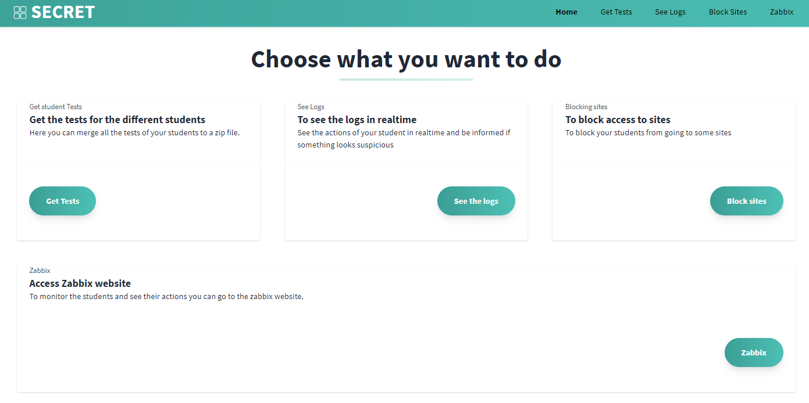
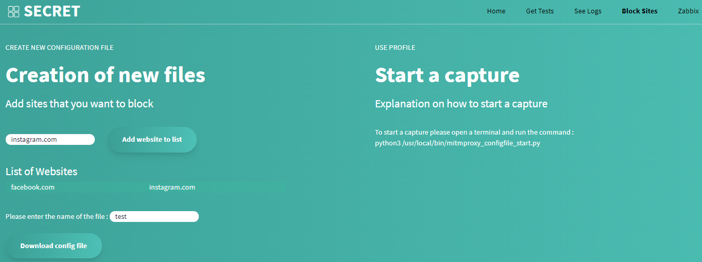
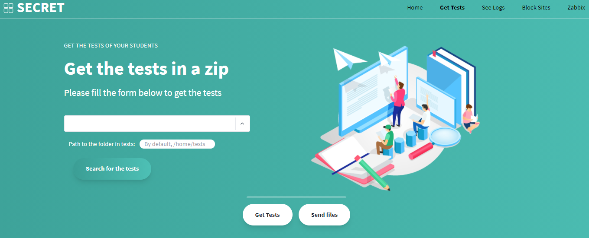
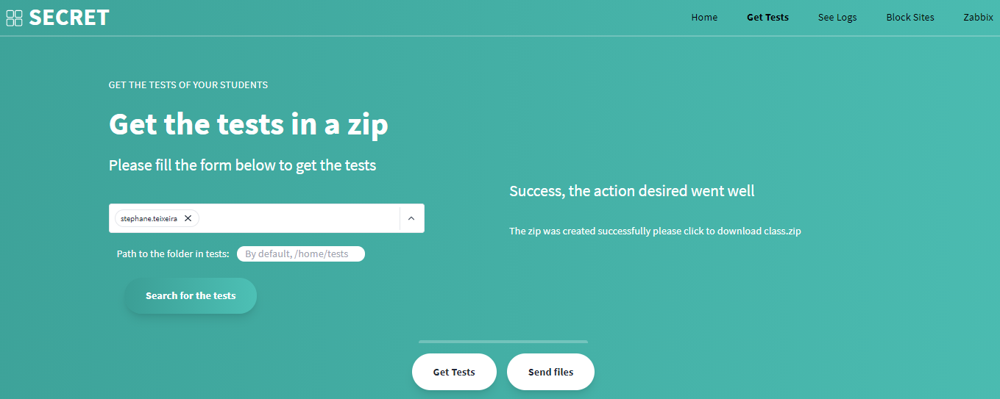
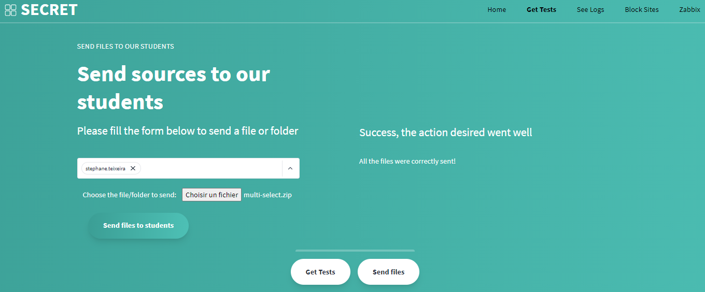

# SECRET II : Secure Environment for automatic test grading, part 2 - Web Site

> Travail de Bachelor 2020-2021
>
> Auteur : Stéphane Teixeira Carvalho
>
> Basé sur le travail de : Caroline Monthoux
>
> Date : 30.07.2021

Ce document va expliquer l'utilité les différents fichiers crée pour le site web du projet SECRET et du résultat graphique de ceux-ci si cela est le cas.
Ce site sera à disposition pour regrouper une multitude de fonctionnalités à un seul endroit qui sera http://localhost.

## Dossier Images
Ce dossier contient toutes les images qui seront utilisées pour le site web.

## Page index.html
Page d'accueil du site web. Elle va contenir des liens vers les différentes fonctionnalités du serveur.

## Page block_sites.php
Page utilisée pour créer et démarrer la fonctionnalité de blocage d'adresse. Sur la gauche, un formulaire servira à générer un fichier de configuration. Puis, sur la droite vous trouverez un texte expliquant comment lancer un script pour démarrer Mitmproxy correctement.

Les sites web indiqués seront ceux non accessibles pendant la durée du test.

Pour le formulaire, vous pouvez ajouter des sites web à une liste. Celle-ci s'agrandira au fur et à mesure et ensuite, une fois ceux-ci choisis, vous devez entrer le nom du fichier. Lorsque le tout est rempli, le bouton _**Download config file**_ va télécharger le fichier en local sur la machine.

Pour plus d'information sur le script à lancer, veuilliez vous référer au dépôt https://github.com/Naludrag/SECRET-II-Installation contenant un fichier `Annexe B - Utilisation Script Python` dans le dossier `Installation/Annexe`.

## Page files.php
Page servant à envoyer des dossiers aux élèves ou à télécharger des fichiers de ceux-ci. Elle contient deux fonctionnalités qui seront expliquées séparément. Par défaut, c'est **Get Tests** qui est affichée, mais vous pouvez changer de méthode en cliquant sur les boutons en bas de page.

### Get Tests
Permets de créer un zip contenant tous les documents du dossier **_tests_** des élèves. Une liste déroulante sera mise à disposition pour choisir ceux pour lesquels il faut prendre des fichiers. Une fonction de recherche est également disponible si la liste est trop longue pour les retrouver.

Il est possible de spécifier un dossier contenu à l'intérieur de **_tests_** en fin de formulaire. Évidemment, il faut que tous les élèves aient créé ce dossier au préalable sinon l'action risque d'échouer pour certains. Lorsque le bouton _**Search for the tests**_ est cliqué, un résultat sera affiché sur la droite de la page et vous pourrez télécharger un zip.

### Send Files
Cette deuxième partie permet d'envoyer des fichiers aux élèves. Le formulaire sera très similaire à celui montré précédemment, le seul changement se situera à la fin de celui-ci. Au lieu d'avoir une entrée utilisateur, un bouton sera maintenant disponible pour choisir le fichier à envoyer.

Une fois le choix effectué, lorsque le bouton _**Send files to students**_ sera pressé les résultats seront affiché sur la droite de la page.

## Fichier functions_for_files.php
Ce fichier ne sera pas une page comme les deux précédentes. Il contient toutes les fonctions php qui seront utilisées par la page **_files.php_**. Il lui permet de fonctionner de manière désirée.
